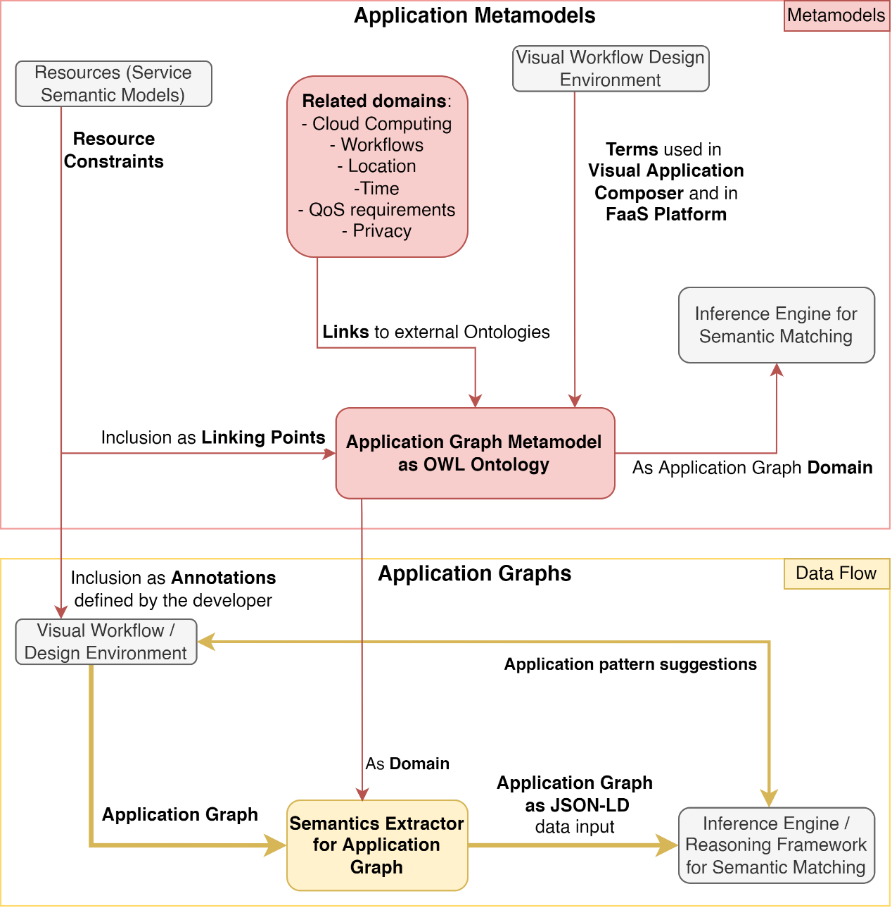

# Semantic Extractor
This repository contains the files that have to do with the semantic extractor. 

The project is **based on Node-RED**.

## Prerequisite steps

1. Copy **[settings.example.js][settings-example]** and paste locally to create the **`settings.js`** file.

## Node-RED admin environment credentials
The **default** credentials, given the default [settings.js][settings-example] are:
- user: **admin**
- password: **physics**

To **replace** with custom credentials follow these **[instructions][node-red-admin-auth]**, and make the changes in the **`settings.js`** file you just created.


## Execute Semantic Extractor
There are **two options**:
* Build a container locally and run it. *(REQUIRES DOCKER)*
* Run node-red locally using a local node.js and node-red installation. *(REQUIRES local Node.js and Node-RED)*

The instructions for each case are provided in the following subsections...

### Run it locally
To run the semantic extractor locally, **Node.js and Node-RED have to be already installed**. Follow the [Node-RED installation instructions][node-red-install], if node-red is not installed. Once Node.js, npm, and Node-RED are properly installed, proceed with the following steps.

In the local directory:
1. Install all dependencies (only once, before first execution):
    ```bash
    npm install
    ```
2. Run node-red on the port of choice, using the current directory (to run a new instance):
   ```bash
    PORT=1880 # Change value to the port you want.
    node-red -p $PORT -u .
    ```

### Build and Run Container
To create a container for the semantic extractor, **Docker (or a Docker-compatible runtime and tooling) has to be installed**! Example build and execution of the semantic extractor project is shown below.
1. Build new docker image called `semantic-extractor`:
    ```bash
    docker build -t semantic-extractor . 
    ```
2. Run a new container called `extractor-example` based on the `semantic-extractor` image:
    ```bash
    docker run -d -p 8080:8080 --name extractor-example semantic-extractor
    ```
3. Stop, start or remove the extractor-example container as usual.

## Description - Usage within PHYSICS

The Semantic Extractor is the component tasked with (a) extracting annotations from Flows and Functions and (b) transforming the JSON representation of Application components from Node-Red into a JSON-LD representation compliant with the PHYSICS Ontology. Its development is to proceed along with the integration of the different parts of the ontology, so as to gradually support the representation of different Application structures, requirements and annotations, as well as the integration with the Inference Engine.

The role of the semantic extractor, and its relationship with the ontology, can be summarised in the image below:



The workflow of the semantic extractor can be summed up in the following steps:
1.	The Design and Control UI triggers the Semantic Extractor to begin its workflow, using the representation of flows from the Node-RED of the developer, and the corresponding deployable artifact locations. The semantic extractor sends an acknowledgement that the extraction trigger has been received.
2.	The included semantic annotations are extracted from each Flow as well as the Functions included.
3.	For the Flows, the annotations are extracted by recognizing annotator nodes, and setting the values that are set in their instance properties.
4.	For the Functions, the single line comments are parsed, in order to create the corresponding annotations. The extraction is done by recognizing the explained syntax within the single-line comments.
5.	The overall structure of the Flow is parsed and transformed in order to be compliant to the ontology. First, the context that introduces the ontology and the various addressing schemes are introduced as a base structure. Then, the flow is filtered, and each node and component are classified as an entity that belongs to a class defined by the ontology, and the properties that connect those entities are added in order to form the proper triples. The result is a JSON-LD document that abides by the ontology, and can thus be introduced as it is in a triple store or reasoning engine. This description also includes the original representation as it was taken from Node-RED, for the cases where the raw representation is needed for simpler orchestration and/or deployment purposes.
6.	Each JSON-LD document that is a flow representation is pushed to the Inference Engine, once it is processed. The reasoning engine then continues with its own process. The inference engine will build upon the representation the extractor provided, by imposing an OWL inference / entailment regime, and using further inference capabilities that build upon it.
7.	The Application ID, and different component IDs that are ready are sent to the Design and Control UI. The user is notified that the selected Flow and the corresponding Application components are ready.
The data transformations are done either manually or with the help of the JSONata library, and the JSON-LD processing is done via RDF.js and mainly its JSON-LD context parser in order to provide a valid, compact and compatible representation of the Application description. As a prototype, the extractor, at the time of writing this thesis, is being developed and tested as a Node-RED flow that processes other flows from the same or other instances of Node-RED, by accessing their admin API. It is meant to be packaged either as a Node-RED extension or as a standalone Node.js service, once it becomes mature enough. Since the way the internals of the extractor operate are heavily dependent on the structures that the ontology imposes, the crystallization of the ontology is going to also help finalize the internals of the Semantic Extractor, so that experimentation and integration is done on more stable grounds.


[physics]: https://physics-faas.eu/
[node-red]: https://nodered.org/
[node-red-admin-auth]: https://nodered.org/docs/user-guide/runtime/securing-node-red#usernamepassword-based-authentication
[settings-example]: /settings.example.js
[node-red-install]: https://nodered.org/docs/getting-started/local
[physics-ontology]: https://github.com/styltsars96/H2020-PHYSICS-App-Ontology
[example-input]: ./examples/helloFunctionV2DEoutput.json
[example-output]: ./examples/SEoutput_SimpleApp_HelloFunctionV2.json